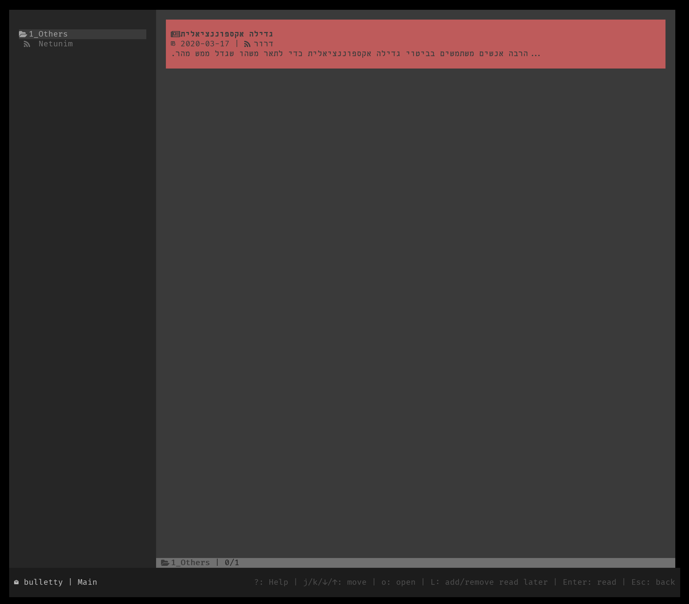
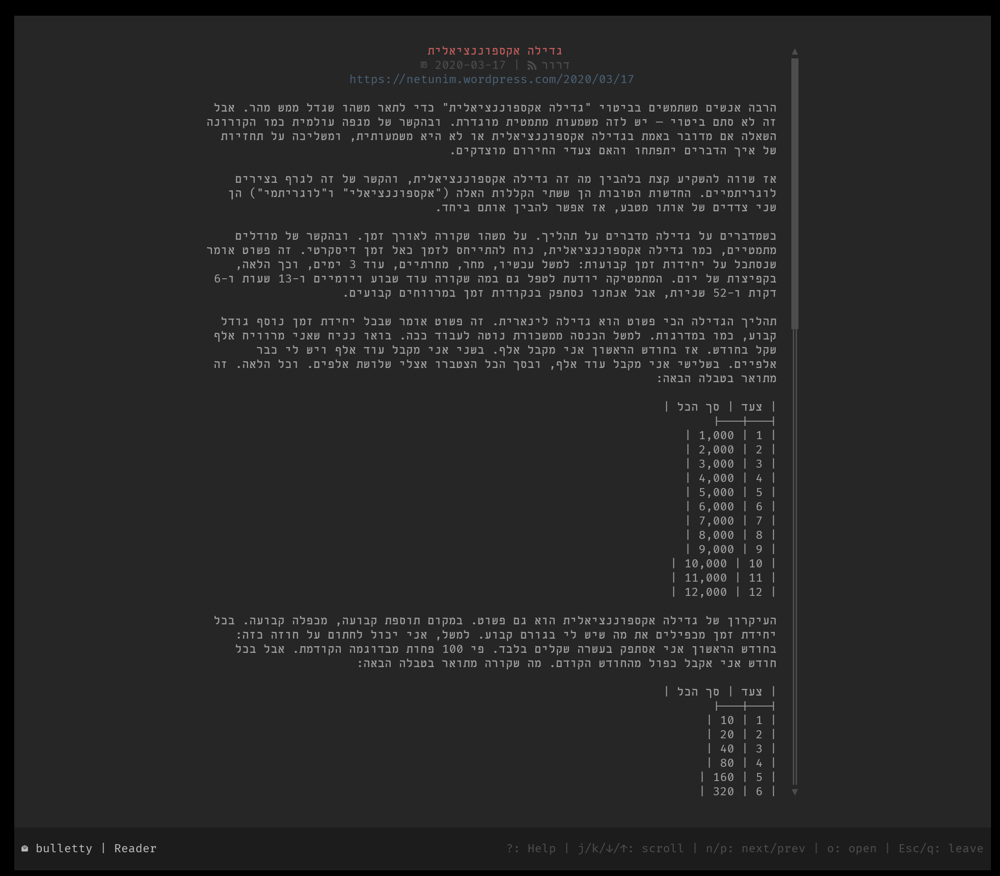

1. Install:
  - [Bulletty](https://github.com/crocidb/bulletty)
  - Python 3.11 (or later)
  - Run `python -m pip install -r requirements.txt`
2. Config: edit `datapath` in `bulletty.toml` and move it to `config.toml` in the path `bulletty dirs local-config`
3. To update feeds and backup old `.md` files, run: `python bulletty_sync.py LIBRARY --backup LIBRARY/Backups`

