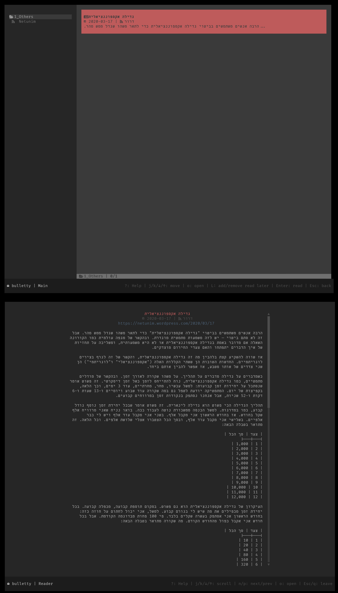

# BullettyFullContentAndRTL

- Installation and usage instructions are given at the top of `bulletty_sync.py`
- Config: edit `datapath` in `bulletty.toml` and move it to `config.toml` in the path `bulletty dirs local-config`

